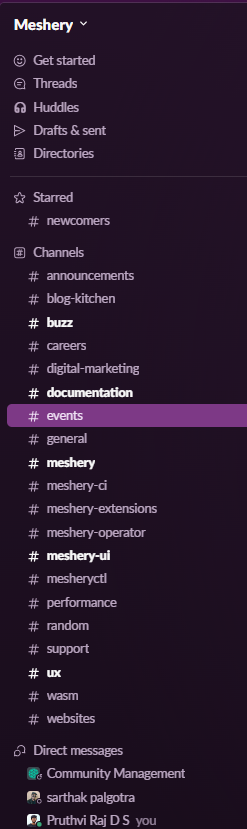
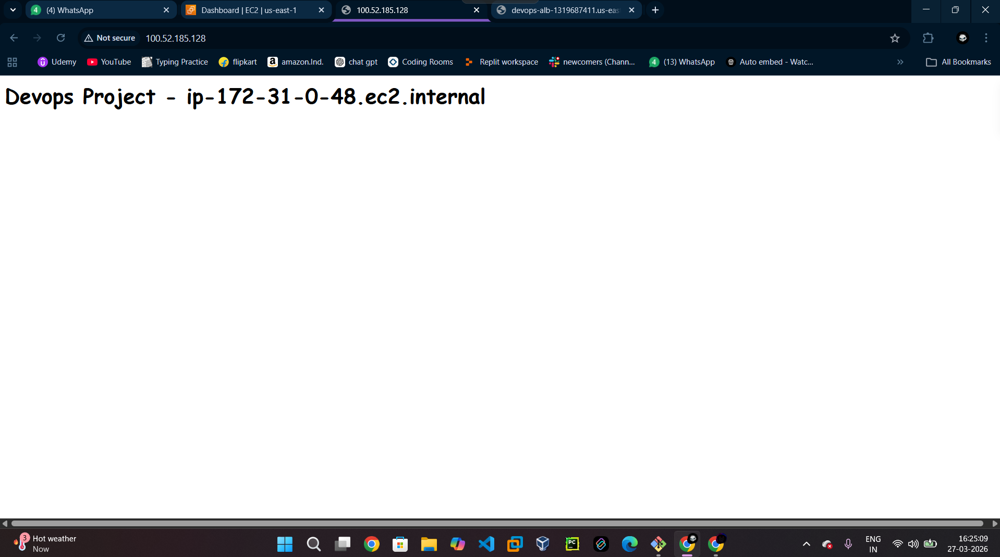
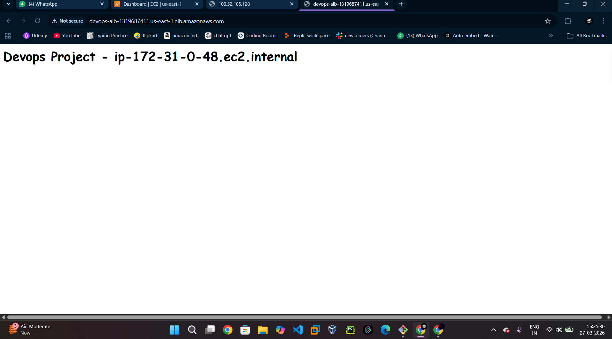
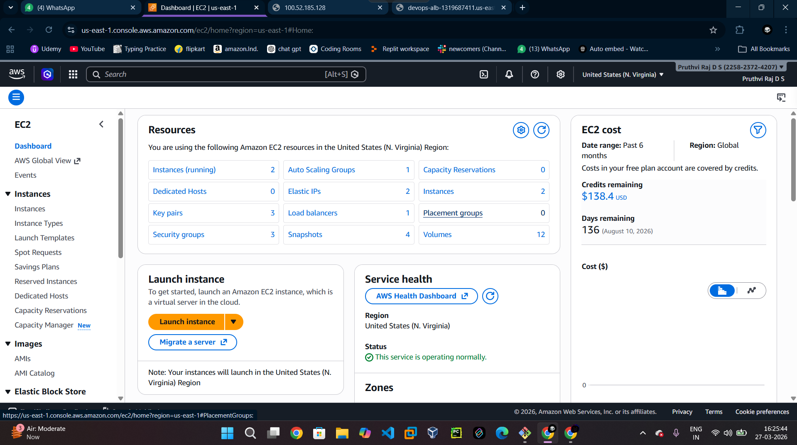
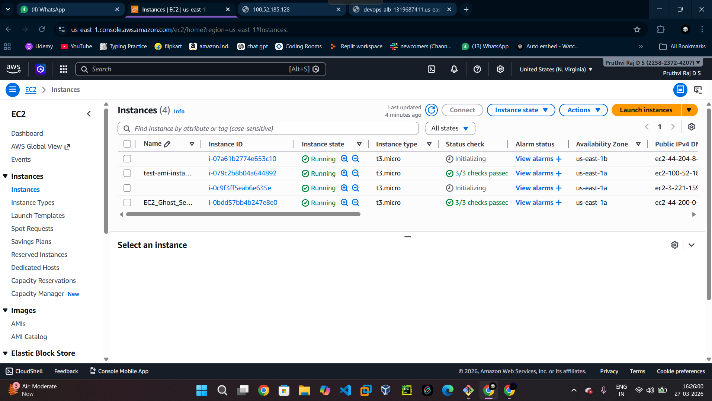
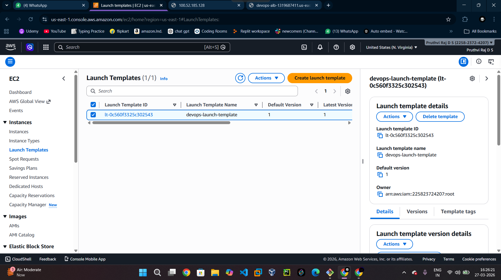
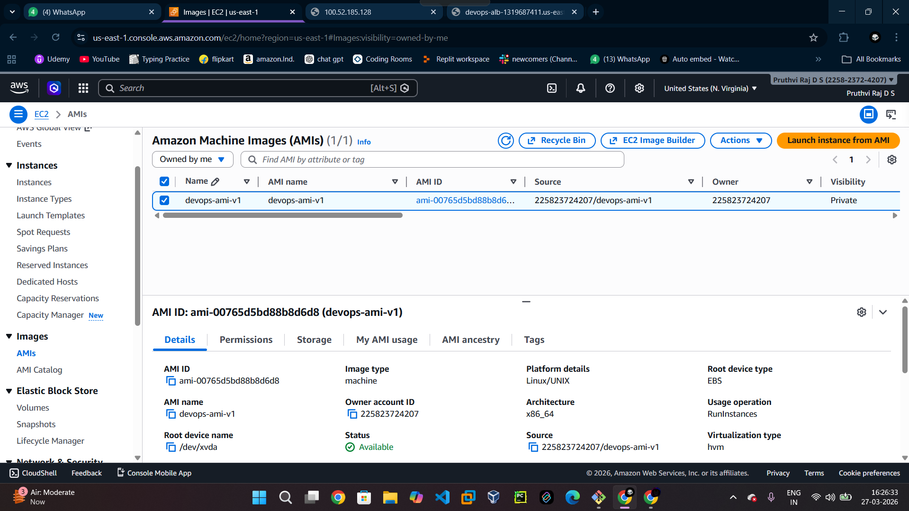
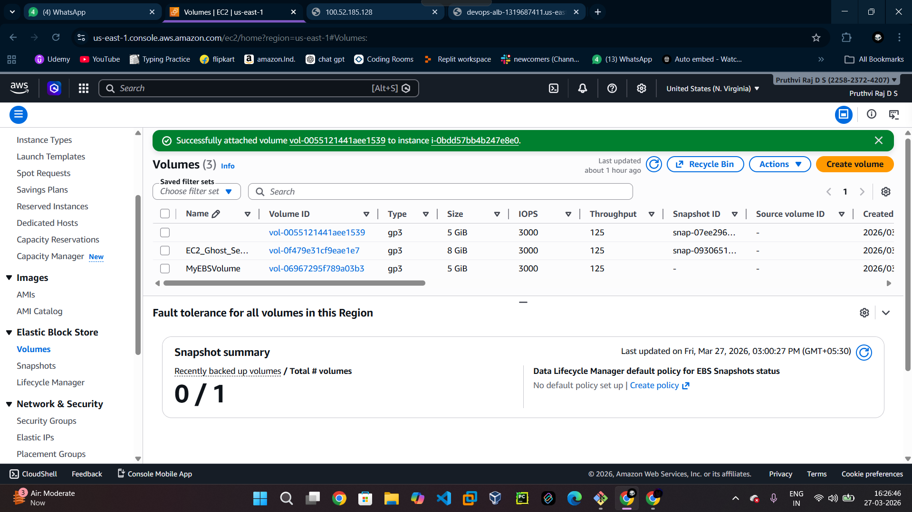

AWS Scalable Web Architecture (DevOps Project)

Overview

This project demonstrates a production-ready scalable web infrastructure built using AWS services.
It is designed to handle dynamic traffic using load balancing and automatic scaling while ensuring high availability and fault tolerance.

Architecture

Users → ALB → Target Group → Auto Scaling Group → EC2 → EBS

Architecture Diagram

AWS Services Used

- Amazon EC2 – Compute instances to host the application
- Amazon EBS – Persistent storage for instances
- Amazon Machine Image – Pre-configured templates for EC2
- Launch Template – Defines instance configuration
- Auto Scaling – Automatically adjusts number of instances
- Elastic Load Balancing – Distributes traffic
- Target Groups – Routes traffic to healthy instances

Features

- ✅ Automated server setup using User Data scripts
- ✅ Dynamic scaling based on CPU utilization
- ✅ Load balancing across multiple EC2 instances
- ✅ Persistent storage using EBS
- ✅ Backup strategy using snapshots

📸 Screenshots

🔹 EC2 Setup

🔹 Load Balancer Configuration

🔹 Target Group

🔹 Auto Scaling Group

🔹 Scaling Activity

🔹 Instance Monitoring

🔹 Additional Configurations

Learning Outcomes

- Gained hands-on experience with AWS infrastructure
- Understood scalable and highly available architecture design
- Implemented real-world DevOps practices
- Learned how to manage traffic using load balancers and scaling

Project Outcome

- Built a fault-tolerant system
- Achieved high availability using multiple EC2 instances
- Improved performance using load balancing
- Enabled automatic scaling based on demand

Future Improvements

- Add CI/CD pipeline (GitHub Actions / AWS CodePipeline)
- Use Docker for containerization
- Implement monitoring with CloudWatch alerts
- Add HTTPS using SSL/TLS

Author

Pruthvi Raj D S
GitHub: https://github.com/2004Pruthvi
